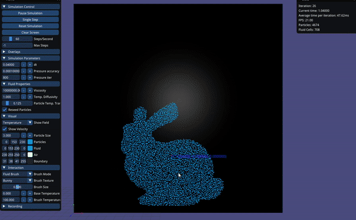
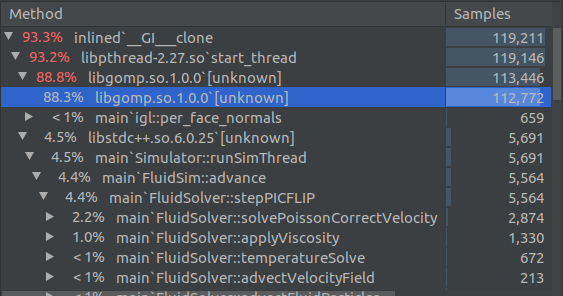

# Melting Fluid Simulation by Roger Barton, Alessia Paccagnella and Nik Houska

- All important hyper-parameters are in `GuiData.h`, most of them can be tweaked in the UI.

**Additional Shortcuts:**  

- `f` - select fluid field
- `g` - pressure field
- `h` - temperature field
- `F` or `v` - select fluid brush
- `H` or `n` - temperature brush
- `Crl+Click` to use other brush
- `1-3` - brush texture

## What has been implemented

- 2D PIC/FLIP fluid simulation
- Implicit **viscosity** solving to allow for high viscosities in real-time based on [2] and [5]
- Adaptive timestep (CLF Condition)
- **Pressure** solving via Gauss-Seidel
  - Ghost pressure at air/fluid boundary
  - Fixed iteration count (more efficient than residual computation)
- Enforce normal dirichlet boundary conditions
- Smart particle **reseeding** based on [6]
    - Add a particle to cell if less than 3  
    - Remove particles if more than 12 in cell
    - Only add particles to non-boundary cells and cells with low velocity (0.5 * dx)
- Implicit **temperature** solver based on [1]
  - Create a *symmetric positive definite* matrix and solve it using the *conjugate gradient* method
  - This matrix and its solver can be precomputed once, see `FluidDomain::buildTemperatureMatrix`
  - Link fluid and temperature simulations by making particles transport some of the temperature, see `FluidSolver::transferTemperatureGridToParticles`
    - Efficiently tuned by `GuiData::m_particleTemperatureTransfer`
    - Works best when slightly below the average particles per grid cell (1/8 by default)
- Viscosity based on temperature by clamped inverse square, can be easily changed in `FluidSolver::updateViscosity`
    - We used this behavior to make the liquid stay solid until a certain temperature
- **Interaction**, click to add particles or temperature
  - Use an image as a brush (based on ascii art export from gimp)
- Works for non-square grids

Probably the most interesting function is `FluidSolver::stepPICFLIP` which gives an overview of a single step.

## Optimization

Note: scaling the grid size by 2x the area means **more than** 2x slowdown -> performance does not scale linearly.

- Used *Eigen* to store grid/position data 
  - This gave a small speedup relative to ArrayT, possibly because of vectorization/alignment done by Eigen
- Main performance bottleneck are the Eigen solvers as well as the Gauss-Seidel pressure solver in `FluidSolver::solvePoissonCorrectVelocity`
- If the solver becomes instable, often with larger grid sizes, the *iterations for the pressure solver* need to be increased. Can be set in the UI.
- Eigen has been setup to run on all cores, all our solvers are `Eigen::ConjugateGradient` with the correct parameters to utilize this parallelism according to https://eigen.tuxfamily.org/dox/TopicMultiThreading.html
  - A potential to improve performance even more would be to use an *adaptive domain* based on min/max particle positions with some padding. However, in most of our scenarios most of the grid is used and this alternate method would incur more overhead.
- We also implemented a way of changing the floating point precision (`doubleT`), however, this has little effect on the frame rate
- Particle advection is done with openmp to make this completely negligible

Below is a profile in CLion for a ~15s high viscosity simulation with a 128x64 grid (using CMake `Release` mode and `g++` 7.4.0  on a i9-9980HK)

*note: libgomp.so is related to eigen parallelisation through opemp*

## References & Links

[1] https://www.cc.gatech.edu/~turk/my_papers/melt.pdf  
[2] https://cs.uwaterloo.ca/~c2batty/papers/BattyBridson08.pdf  
[3] https://www.cs.ubc.ca/~rbridson/fluidsimulation/fluids_notes.pdf  
[4] https://github.com/kbladin/Fluid_Simulation  
[5] https://github.com/rlguy/FLIPViscosity3D  
[6] https://pdfs.semanticscholar.org/a1bb/ba8ad75b4ffdaebfe56ce1aec35414247d14.pdf
